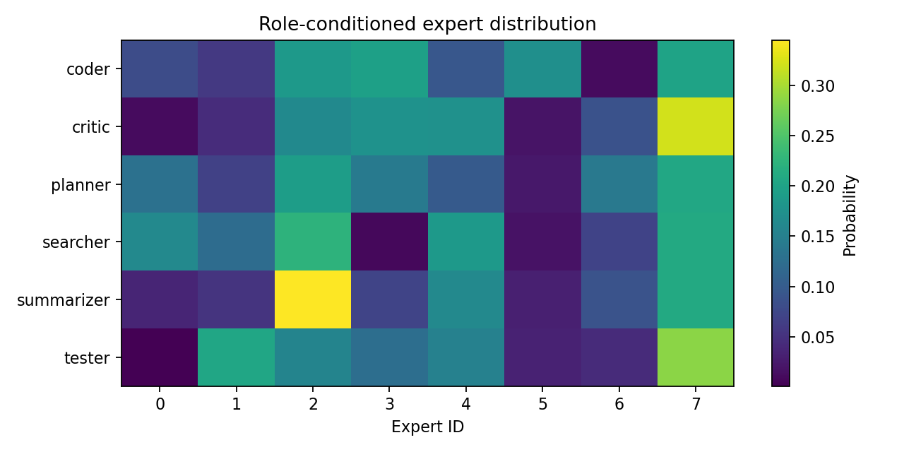
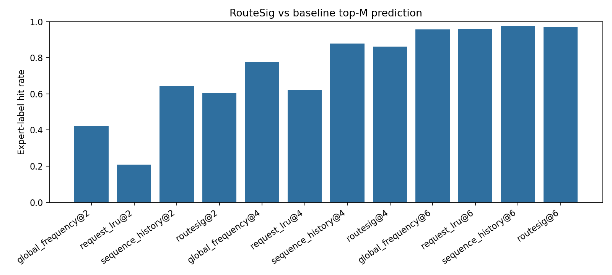
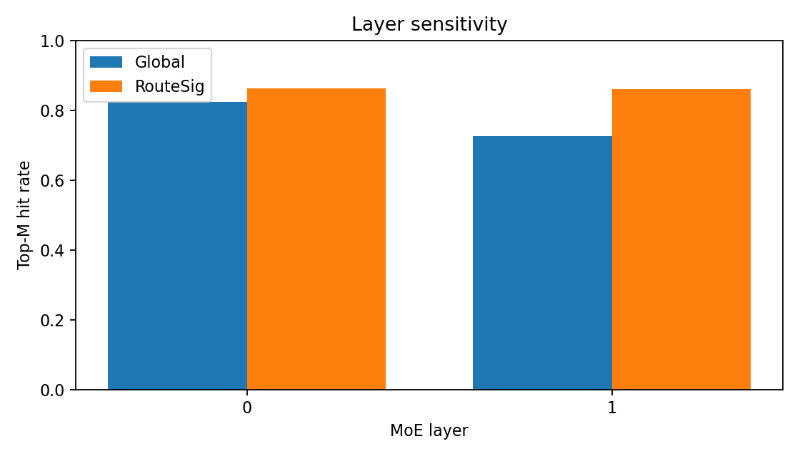
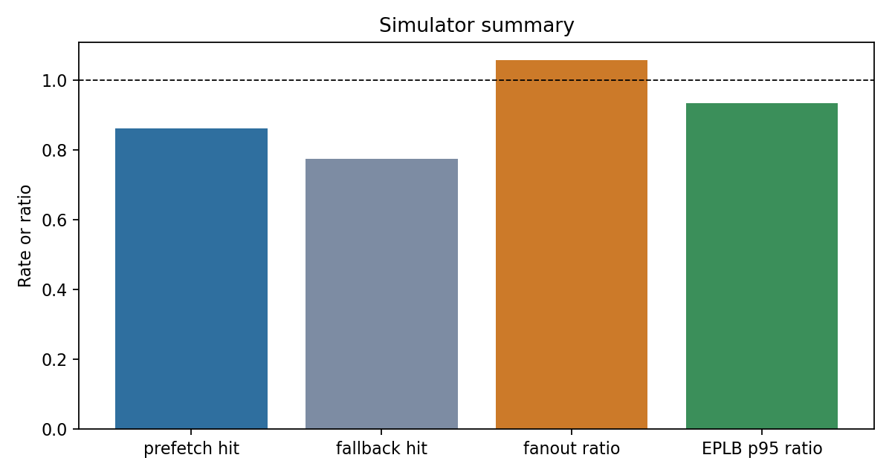

# TokenMoE Locality Report

Records: **80**.

## Metrics

- RouteSig best hit rate: **0.969** at top-6.
- Global-frequency best hit rate: **0.957** at top-6.
- Cross-agent JSD: **0.1245**.
- Mean route entropy: **1.5060**.

## Simulator Snapshot

- Prefetch hit rate: **0.861**; wasted prefetch rate: **0.021**.
- Scheduler mean active expert fanout: baseline **13.48**, TokenMoE replay **14.24**.
- EPLB p95 tail proxy: moving average **584.96**, TokenMoE future-demand replay **546.43**.
