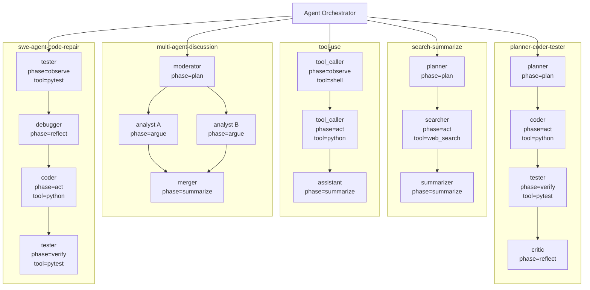

# Agent负载中的MoE Expert优化方案

## 背景介绍

### 从Expert状态的视角看MoE模型

本工作的优化对象是MoE模型中的**Expert状态**。

MoE模型把Transformer中的部分FFN层替换为多个专家。每个token先经过router，router选择少量专家进行计算。例如DeepSeek-V3是671B总参数、每token激活37B参数；Qwen3-235B-A22B是235B总参数、每token激活22B参数；Kimi K2是1T总参数、每token激活32B参数。MoE的优势是计算稀疏，但系统问题也来自这里：**需要存储的专家很多，实际激活的专家很少，且激活集合由运行时router决定**。

这带来两个典型场景：

- **端侧或显存不足场景**：GPU内只能保存一部分experts。未命中的expert需要从CPU、UFS、NVMe或远端内存加载。router在模型内部才给出专家选择，加载信息出现得太晚。
- **服务端显存充足场景**：experts分布在多个GPU上。router会造成token dispatch、all-to-all通信、per-expert负载不均和小batch GEMM。问题不是能不能放下experts，而是如何放置、复制和调度experts。

因此，MoE Serving的本质问题不是“模型只激活少量参数”，而是：

> 系统需要在router结果真正出现之前，提前准备即将被访问的expert状态。

### 从Agent负载的视角看Router

普通LLM Serving看到的是一串请求。系统不知道这个请求为什么出现，也不知道下一个请求是什么。

Agent Serving不同。一个Agent应用通常由Orchestrator调度多个LLM请求。每个请求可以看作Agent执行图上的一个节点：



图上的每个节点都是一次LLM请求。这个节点在进入模型之前，系统已经知道一些信息：

- 这是哪个agent；
- agent的role是什么，例如planner、coder、searcher、critic、tool caller；
- 当前phase是什么，例如plan、act、observe、reflect、summarize；
- **prompt中包含哪些block，例如system role、private memory、tool result、shared context；**
- **agent图中哪些节点已经ready，哪些节点可能接下来运行。**

这些信息不会替代MoE router。真实router仍然执行，模型输出保持不变。但这些信息可以用于提前预测：

```
agent role + phase + block type + graph node
    -> per-layer expert working set
```

这就是TokenMoE的核心机会：**Agent负载给了MoE router之前可见的结构化信号**。

### 现有方案的局限

已有MoE系统已经证明expert prediction、expert cache、expert prefetch和expert placement是重要问题。

- MoE-Infinity利用request-level expert activation trace进行expert caching和prefetch。
- ProMoE利用中间结果预测后续expert使用。
- fMoE / FineMoE利用expert selection pattern和prompt semantic hints进行细粒度offloading。
- ExpertFlow结合routing path predictor、token scheduling和expert cache。
- Local Routing Consistency研究不同MoE模型是否适合expert offloading。
- ReMoE通过router fine-tuning提升短期expert复用。
- vLLM EPLB通过复制hot experts缓解Expert Parallel中的负载不均。

原有工作主要利用的是以下信息：

- token或sequence级别的历史router trace；
- 当前请求的中间hidden states；
- prompt semantic embedding；
- 最近窗口内的expert访问统计；
- router本身的训练或微调。

这些信息有一个共同问题：**它们大多发生在请求内部，或者发生在expert已经开始变热之后**。

Agent Serving额外提供了一个更早的信号：请求还没有进入MoE模型，系统就知道它在Agent图中的位置、角色和阶段。这个信号可以把expert预测从“router之后或layer之间”提前到“request admission和agent scheduling阶段”。

## 优化思路分析

### 核心观察

核心观察是：Agent workload中，同一类agent节点会反复执行相似功能，因此它们在MoE router上的expert footprint可能稳定。

这里的“同一类”不是简单的request文本相似，而是由Agent系统直接暴露出来的结构：

- 同一个role：planner、coder、critic、searcher；
- 同一个phase：planning、tool use、summarization、reflection；
- 同一个prompt block类型：tool result、memory、shared message、instruction；
- 同一个graph node或相邻graph node；
- 同一个agent在多轮运行中的重复行为。

如果这个观察成立，那么系统可以提前形成一个轻量的route signature：

```
RouteSig(role, phase, block_type, layer)
    -> likely experts + probability + confidence + miss cost
```

RouteSig不改变router。它只用于系统决策：

- 哪些experts应该提前load到GPU；
- 哪些experts应该继续留在GPU；
- 哪些ready agent nodes应该合在一个batch；
- 哪些hot experts应该在服务端提前复制；
- 哪些expert dispatch会形成负载峰值。

### 普遍问题定义

本工作解决的不是某一个Agent应用，而是一类结构化LLM负载上的MoE Serving问题。

给定：

- 一个Agent执行图 `G=(V,E)`，每个节点 `v` 是一次LLM请求；
- 每个节点的元数据 `x_v`，包括agent id、role、phase、tool type、prompt block type；
- 一个MoE模型，包含多层MoE FFN，每层有多个experts；
- 一个运行环境，可能是单GPU加CPU/NVMe offload，也可能是多GPU Expert Parallel；
- GPU显存、PCIe/NVLink带宽、expert load cost、expert compute cost和all-to-all通信代价。

目标是：

> 在不改变模型输出的前提下，决定expert的驻留、预取、驱逐、调度和复制策略，最小化Agent任务的端到端延迟。

### 与Baseline的对比

#### 方案0：普通MoE Serving

```
请求进入模型
  -> router逐层计算expert选择
  -> 按真实router结果加载或调度experts
```

特点：

- 输出完全正确；
- 系统不提前知道expert需求；
- 端侧会发生expert miss stall；
- 服务端会被hot experts和all-to-all尾延迟影响。

#### 方案1：基于历史访问的Expert Cache

```
最近访问过的experts留在GPU
低频experts被驱逐
```

特点：

- 实现简单；
- 对短期temporal locality有效；
- 不知道当前请求的agent角色和未来ready节点；
- 对agent phase切换和branch切换反应慢。

#### 方案2：基于请求内部信息的Expert Prediction

```
利用已经计算出的hidden states或前几层router结果
  -> 预测后续层expert使用
  -> 做prefetch
```

特点：

- 比纯历史cache更准；
- 但预测信号出现得较晚；
- 对端侧offload来说，预取lead time可能不足；
- 对请求级batch调度和服务端replica placement帮助有限。

#### 方案3：Agent-Conditioned Expert Prediction

```
请求进入模型之前
  -> 根据agent role / phase / graph node预测每层expert working set
  -> 提前load或保留experts
```

特点：

- 预测时间更早；
- 不依赖修改模型；
- 真实router仍然执行，输出保持exact；
- 预测错误只影响性能，不影响正确性。

#### 方案4：完整TokenMoE

```
Agent图预测ready nodes
  -> RouteSig预测expert working set
  -> Expert cache / prefetch
  -> Expert-overlap-aware scheduling
  -> Proactive expert replica placement
```

特点：

- 端侧减少expert miss；
- 单机减少expert cache thrashing；
- 多GPU减少active expert fanout和all-to-all碎片；
- 服务端提前处理hot expert burst。

#### 性能对比总结

| 方案                         | 预测信号                      | 作用对象                                | 主要收益                | 主要局限                  |
| ---------------------------- | ----------------------------- | --------------------------------------- | ----------------------- | ------------------------- |
| 普通MoE Serving              | 无                            | router之后的expert执行                  | 简单、exact             | 无提前量                  |
| LRU/LFU Expert Cache         | 最近expert访问                | expert residency                        | 实现简单                | 不理解agent phase         |
| 请求内部预测                 | hidden states / early routers | expert prefetch                         | 对后续层有效            | lead time短               |
| Agent-Conditioned Prediction | role / phase / graph node     | expert working set                      | router前预测            | 需要agent-router locality |
| TokenMoE                     | agent图 + RouteSig            | cache / prefetch / scheduling / replica | 同时优化端侧和服务端MoE | 需要运行时集成            |

## TokenMoE设计

### 设计目标

TokenMoE只做MoE相关优化，核心是：利用Agent系统暴露的结构化信息，提前预测MoE expert需求，并把预测结果用于expert状态管理。

### 模块1：Agent-Router Profiler

运行时记录每个Agent节点的router trace。

对每个请求节点 `v`，记录：

```
NodeMeta(v):
  agent_id
  role
  phase
  tool_type
  graph_node_type
  prompt_block_layout
  input_length
  output_length
```

对每层MoE，记录：

```
RouteTrace(v, layer):
  selected_experts[token_id, top_k]
  router_scores[token_id, top_k]
  active_expert_histogram
  expert_load_time
  expert_compute_time
  dispatch_time
```

这些trace用于回答一个基础问题：

> Agent元数据能否解释router选择？

需要先做characterization，而不是直接假设成立。

### 模块2：Agent-Conditioned Route Signature

RouteSig是一个轻量统计结构，不是一个复杂模型。

基本形式：

```
RouteSig(key, layer):
  key = (role, phase, tool_type, block_type)
  expert_prob[e]
  entropy
  top_m_experts
  confidence
  miss_cost[e]
```

其中：

- `expert_prob[e]` 表示该类agent节点在这一层访问expert `e` 的概率；
- `entropy` 衡量分布是否集中；
- `top_m_experts` 是预测的working set；
- `confidence` 由样本数、entropy和最近trace稳定性决定；
- `miss_cost[e]` 表示如果expert不在GPU上，代价有多高。

如果某个agent已经积累足够trace，就用agent-specific signature；否则用role或phase级别统计。

### 模块3：端侧Expert Cache和Prefetch

端侧场景中，GPU只能放一部分experts。TokenMoE把expert cache从“最近访问”改为“未来收益”。

对未来窗口内的agent节点集合 `W`，计算每个expert的收益：

```
Benefit(e) =
  sum over v in W:
    P(v will run) *
    P(e is used by v) *
    MissCost(e, v) *
    Criticality(v)
```

系统保留Benefit高的experts，驱逐Benefit低的experts。

运行流程：

```
1. Orchestrator提交ready agent nodes
2. TokenMoE读取每个node的RouteSig
3. 计算未来几层或未来几个node的expert demand
4. 在请求真正进入MoE层之前，异步prefetch high-benefit experts
5. 真实router执行
6. 如果命中，直接计算；如果未命中，按原路径加载，输出仍然正确
7. 用真实RouteTrace更新RouteSig
```

这个优化的核心不是更复杂的cache policy，而是提前量：

```
普通offloading: router完成后才知道要load哪个expert
TokenMoE: request admission时就开始load likely experts
```

### 模块4：Expert-Overlap-Aware Agent Scheduling

Agent runtime中经常同时存在多个ready nodes。只要依赖关系满足，调度器可以选择先运行哪个node，或者把哪些nodes放进同一个batch。

TokenMoE利用RouteSig计算ready nodes之间的expert overlap：

```
Overlap(u, v) =
  average over layers:
    |TopM(u, layer) ∩ TopM(v, layer)| /
    |TopM(u, layer) ∪ TopM(v, layer)|
```

调度目标不是改变Agent语义，而是在合法ready set内选择更适合MoE执行的batch。

```
Ready nodes:
  SearchAgent: predicted experts {1, 7, 9, 20}
  Summarizer:  predicted experts {1, 7, 10, 20}
  CodeAgent:   predicted experts {3, 18, 44, 70}

调度:
  SearchAgent + Summarizer 合batch
  CodeAgent 单独或延后
```

收益来自四个方面：

- 减少expert cache thrashing；
- 减少单个batch中的active expert fanout；
- 增大per-expert token batch，提升grouped GEMM效率；
- 减少Expert Parallel中的all-to-all message碎片和tail latency。

这是MoE特有的调度机会。普通dense LLM没有expert fanout和per-expert batch size问题。

### 模块5：服务端Proactive Expert Replica Placement

服务端显存充足时，主要问题不是offload，而是Expert Parallel负载不均。

普通EPLB根据最近窗口统计hot experts，然后复制或迁移experts。这个策略是reactive的：

```
expert已经热了 -> 观察到负载不均 -> 调整replica
```

TokenMoE根据Agent图和RouteSig做proactive placement：

```
未来ready nodes中多数是CodeAgent / ToolAgent
  -> 预测某些experts即将变热
  -> 提前复制这些experts
  -> router结果出现后，把tokens分派到较空闲的replica
```

服务端优化目标：

```
minimize:
  max_device_expert_load
  + all_to_all_tail_latency
  + replica_migration_cost
```

约束：

- 每个GPU显存有限；
- replica创建和迁移有代价；
- token必须发送到真实router选择的expert或其replica；
- 不改变router选择和模型输出。

这个模块可以建立在现有EPLB之上。区别在于，TokenMoE提供的是agent-conditioned future demand，而不是只看过去窗口。

### 模块6：可选的Expert-Level Speculation

Speculation不作为主贡献。

如果要做，只做MoE内部的speculation，不做Agent子图speculation：

```
某个LLM请求已经确定要执行
RouteSig对某层experts置信度很高
  -> 提前prefetch或提前执行少量likely experts
  -> 真实router命中则复用
  -> 未命中则丢弃
```

更稳妥的主线是speculative prefetch，而不是speculative compute。因为prefetch错误只浪费带宽，compute错误会浪费GPU算力并增加调度复杂度。

## 关键创新点

### 创新点1：Agent-Router Locality

现有MoE locality通常指相邻tokens或相邻layers之间的expert复用。TokenMoE关注的是另一种locality：

```
agent role / phase / graph node
  -> expert distribution
```

如果这个locality成立，它比token-level locality更早出现。token-level locality要等请求开始生成后才能观察，agent-router locality在请求进入模型前就可用。

### 创新点2：RouteSig作为系统级抽象

RouteSig把MoE router trace转成系统可用的expert working set摘要。

它不是模型的一部分，而是serving runtime的一部分。它服务于：

- expert prefetch；
- expert eviction；
- agent batch scheduling；
- EP replica placement；
- overload prediction。

这个抽象把Agent metadata和MoE expert状态连接起来。

### 创新点3：Expert-Overlap-Aware Agent Scheduling

Agent runtime本来就需要调度ready nodes。TokenMoE把MoE expert overlap加入调度目标。

这不是普通请求batching。普通batching主要看到达时间和长度。TokenMoE看的是：这些请求会不会激活相同experts？

对于MoE模型，这直接影响kernel效率和通信效率。

## 与已有工作的边界

| 工作           | 主要对象                                   | 使用信号                        | 与TokenMoE的区别                                        |
| -------------- | ------------------------------------------ | ------------------------------- | ------------------------------------------------------- |
| TokenCake      | Agent负载中的KVCache复用                   | Agent通信结构                   | TokenMoE不优化KVCache，优化expert状态                   |
| TokenDance     | Agent级推测执行                            | Agent图和执行路径               | TokenMoE不推测子图执行，只准备MoE experts               |
| MoE-Infinity   | Expert offloading                          | request-level activation trace  | TokenMoE使用agent role / phase / graph node作为更早信号 |
| ProMoE         | Expert proactive caching                   | 中间结果                        | TokenMoE在request admission阶段预测，而不是等中间结果   |
| fMoE / FineMoE | 细粒度expert offloading                    | expert pattern + semantic hints | TokenMoE显式利用Agent runtime元数据和ready-node调度     |
| ExpertFlow     | Predictive expert cache + token scheduling | routing path predictor          | TokenMoE把agent node scheduling作为MoE执行前的调度对象  |
| ReMoE          | Router fine-tuning                         | 修改router行为                  | TokenMoE不改router，不改变模型行为                      |
| vLLM EPLB      | Expert replica load balance                | 最近负载统计                    | TokenMoE用未来agent mix做proactive replica placement    |

## 实验设置与结论

### Agent workload配置

当前原型使用内部的规范化Agent workload生成器。这样做的目的是把不同Agent框架都会暴露的结构统一成一组稳定字段：

```
agent_id
role
phase
tool_type
graph_node_type
prompt_block_types
dependencies
ready_time
criticality
```

五类workflow分别是：

| Workflow                 | 每个实例的节点关系                                      | 单实例节点数 | 当前请求数 |
| ------------------------ | ------------------------------------------------------- | ------------ | ---------- |
| `planner-coder-tester`   | planner -> coder -> tester -> critic                    | 4            | 48         |
| `search-summarize`       | planner -> searcher -> summarizer                       | 3            | 36         |
| `tool-use`               | tool_caller/observe -> tool_caller/act -> assistant     | 3            | 36         |
| `multi-agent-discussion` | moderator -> analyst A/B -> merger                      | 4            | 48         |
| `swe-agent-code-repair`  | tester/reproduce -> debugger -> coder -> tester/regress | 4            | 48         |

依赖关系分布为：60个root节点没有依赖，144个节点有1个依赖，12个join节点有2个依赖。调度replay只允许在依赖满足的ready set内部重排，因此不会改变Agent图语义。

### MoE trace采集配置

当前MoE实验使用小型真实MoE模型做router trace characterization：

这80条trace来自workload前两个workflow的一部分：

| Workflow               | Trace数 | Role覆盖                       |
| ---------------------- | ------: | ------------------------------ |
| `planner-coder-tester` |      48 | planner、coder、tester、critic |
| `search-summarize`     |      32 | planner、searcher、summarizer  |

采集流程是：

```
1. 读取Agent workload JSONL
2. 对每条请求执行Tiny Mixtral前向
3. 打开output_router_logits
4. 对每个MoE层的router logits做softmax
5. 取top-k expert id和score
6. 写入TraceRecord
7. 生成JSONL和Parquet两种trace格式
```

每条 `TraceRecord` 保存：

```
request_id
AgentNodeMeta
model_id
backend
prompt
prompt_token_count
output_token_count
per-layer selected_experts[token, top_k]
per-layer router_scores[token, top_k]
per-layer active_expert_histogram
```

### RouteSig评估设置

RouteSig评估采用时间顺序切分：

```
train_fraction = 0.7
前70% trace用于初始化predictor
后30% trace用于在线评估
评估过程中每处理一条eval trace后，再用真实router结果更新predictor
```

比较的predictor包括：

| Predictor          | 信号                         |
| ------------------ | ---------------------------- |
| `global_frequency` | 每层全局热门expert           |
| `request_lru`      | 最近请求访问过的expert       |
| `sequence_history` | agent_id或role级历史统计     |
| `routesig`         | 分层Agent metadata signature |

RouteSig使用的fallback key顺序是：

```
(agent_id, role, phase, block_type)
  -> (role, phase, block_type)
  -> (role, phase)
  -> (role)
  -> global
```

核心指标是Top-M hit rate，即预测出的top-M专家集合覆盖真实router top-k专家标签的比例。因为Tiny Mixtral每个token每层选择top-2 experts，所以每个token-layer会产生2个expert labels。Top-M越大，覆盖率自然越高，但prefetch成本也越高。因此当前最有解释价值的是top-4，而不是top-6。

### Agent-Router locality结论

当前结果说明Agent metadata确实包含router之前可见的expert locality信号：


这张图只展示了role条件下的expert分布。它可以说明locality存在，但还不能说明这个locality来自哪里、会在什么时候变化、以及如何转化成系统动作。后续分析需要把图中的信号补全到四类：

- Agent图信号：`dependencies`、`ready_time`、`run_probability`、`criticality`；
- 节点元数据信号：`agent_id`、`role`、`phase`、`tool_type`、`graph_node_type`、`prompt_block_types`；
- Router信号：`layer_id`、`selected_experts[token, top_k]`、`router_scores[token, top_k]`、`active_expert_histogram`；
- 系统信号：expert是否resident、prefetch是否命中、batch内active expert fanout、EPLB tail load。

更完整的图应当表达下面这条链路：

```text
Agent DAG和ready nodes
  -> 节点元数据
  -> 每层RouteSig分布
  -> expert working set
  -> prefetch / scheduling / replica placement
  -> 真实router trace回写
```

这条链路的边界仍然很明确：RouteSig只提供router之前的先验，真实router结果仍然是最终执行依据。

### 概率图解释

TokenMoE可以看作两个概率图之间的连接。

第一个概率图是Agent执行图。每个节点 `v` 是一次LLM请求，依赖边 `u -> v` 约束执行顺序。节点是否运行、什么时候ready、是否处在关键路径上，都可能影响未来expert需求：

```text
Z_v        : 节点v是否会执行
T_v        : 节点v的ready time
C_v        : criticality / deadline权重
X_v        : router前可见metadata
             (agent_id, role, phase, tool_type, graph_node_type, block_types)
Deps(v)    : 节点v的依赖集合
```

第二个概率图是MoE routing图。对节点 `v`、MoE层 `l`、token `t`，router选择top-k experts：

```text
R(v,l,t,k) : 第v个请求在layer l、token t、第k个slot选择的expert
E(v,l)     : 请求v在layer l上的expert working set
S(v,l,e)   : expert e的router score或统计概率
```

TokenMoE要估计的是：

```text
P(E(v,l)=e | X_v)
```

其中 `X_v` 可以先用离散metadata表示。具体key样本不足时，使用当前实现中的分层fallback：

```text
(agent_id, role, phase, block_type)
  -> (role, phase, block_type)
  -> (role, phase)
  -> (role)
  -> global
```

系统动作也是概率决策，而不是硬规则：

```text
A_v = prefetch / keep / evict / schedule / replicate
```

目标不是提高router预测本身的准确率，而是降低系统期望成本：

```text
minimize:
  expert_miss_cost
  + prefetch_bandwidth_cost
  + scheduling_wait_cost
  + all_to_all_tail_cost
  + replica_migration_cost

subject to:
  Agent依赖不被破坏
  token仍然发送到真实router选择的expert或其合法replica
  预测低置信度时退回baseline
```

这里的expert也不一定只作为flat expert id使用。后续可以把expert按稳定性和作用范围分级：

| Expert类型 | 含义 | 用途 |
| --- | --- | --- |
| 全局hot expert | 多数role和phase都会访问 | 常驻或优先复制 |
| role相关expert | 特定role稳定访问 | role-conditioned prefetch |
| phase相关expert | plan、act、verify等阶段相关 | phase切换时调整working set |
| agent-specific expert | 某个agent_id或workflow特有 | 多轮agent的个性化cache |
| layer-sensitive expert | 只在部分MoE层有明显收益 | 按layer启用或关闭TokenMoE |

### 预测模型升级路线

当前仓库实现的是统计版RouteSig。这个版本适合第一阶段，因为它可解释、可fallback，并且不会改变router行为。更复杂的模型应当作为RouteSig的增强项，而不是一开始替代它。

后续可以沿着三条线扩展。

第一，为每个 `(layer, expert)` 维护temporal embedding。这个embedding记录最近访问时间、复用距离、窗口频率、burst强度、entropy漂移、miss cost和当前resident状态，用来描述agent phase切换带来的time locality变化。

第二，把Agent DAG编码进预测器。节点位置、前驱role、后继候选、run probability和criticality可以作为graph feature。数据足够后，可以把Agent节点和Expert节点建成二部图，用GNN预测未来窗口内的expert demand。

第三，在系统动作层引入学习策略。MLP可以先作为RouteSig后面的reranker，输出每层top-M experts、confidence和expected miss cost。RL或contextual bandit只用于选择prefetch、evict、delay和replicate这类动作，奖励来自命中率、stall减少、带宽浪费和等待时间。

Layer问题需要单独处理。当前Tiny Mixtral结果已经显示Layer 1的RouteSig收益显著高于Layer 0，因此后续不应该采用“所有MoE层统一开启”的策略。每个layer至少需要维护：

```text
expert_prob_l
entropy_l
confidence_l
delta_vs_global_l
miss_cost_l
```

启用策略应当是：

```text
if confidence_l high and delta_vs_global_l positive:
    use RouteSig for this layer
else:
    use global/history/baseline for this layer
```

这也对应MoE文献中的model suitability问题：不同模型、不同层的routing consistency差异很大，TokenMoE的收益应按layer和模型结构报告，而不是只报一个总体平均值。

| 指标                     |   数值 | 含义                                           |
| ------------------------ | -----: | ---------------------------------------------- |
| Cross-agent JSD          | 0.1245 | 不同role/phase的expert分布存在差异             |
| Mean route entropy       | 1.5060 | expert分布不是完全均匀随机                     |
| Mean cross-group Jaccard | 0.8788 | 不同group共享一部分experts，但仍存在可利用偏差 |

这组结果支持TokenMoE的基础假设：Agent节点的role、phase、tool type和prompt block layout可以在router执行前提供弱但稳定的expert working set提示。

### Agent对时间局部性的影响

传统expert cache主要依赖最近窗口locality：刚访问过的expert更可能再次访问。Agent workload会改变这个假设，因为请求序列不是独立同分布，而是由DAG阶段推进产生：

```text
planner -> coder -> tester -> critic
searcher -> summarizer
tester/reproduce -> debugger -> coder -> tester/regress
```

同一个workflow内，phase切换可能让expert working set发生跳变；并行ready nodes又给了调度器选择执行顺序的空间。因此，Agent负载里的locality需要同时看时间维度和空间维度。

时间维度主要回答：

- 同一expert的reuse distance是多少；
- role/phase切换后，expert集合如何变化；
- 相邻DAG节点和相邻batch之间的expert集合重合度是多少；
- 不同历史窗口下，LRU、global frequency和RouteSig的命中率如何变化；
- 某个expert是否会在短窗口内形成burst。

空间维度主要回答：

- 不同role/phase/block type的expert分布是否不同；
- 每层active expert fanout是多少；
- per-expert token count和grouped GEMM batch size是否变大；
- batch内部的expert overlap是否提升；
- Expert Parallel下per-GPU load和all-to-all tail是否下降。

DAG replay是把locality现象连接到系统收益的关键步骤。当前仓库已经有 `dependencies`、`ready_time`、`criticality` 和scheduler replay，但 `tokenmoe/simulators.py` 中的调度replay使用真实active experts作为上界代理。因此当前结果只能说明机制可replay，不能直接作为在线调度收益。

下一步需要改成预测版replay：

```text
输入:
  Agent DAG
  workload metadata
  historical RouteTrace
  RouteSig or baseline predictor

每个时间步:
  1. 找到依赖满足的ready nodes
  2. 对每个候选node预测per-layer top-M expert set
  3. 在delay guard和fairness约束内选择batch
  4. 用真实trace计算实际fanout、hit/miss、per-expert token count
  5. 用真实router结果在线更新predictor

输出:
  active expert fanout
  per-expert token count
  prefetch hit/waste
  waiting time / deadline miss
  all-to-all tail proxy
  EPLB p95/p99 tail proxy
```

需要对比的策略包括FIFO、global frequency、request LRU、sequence history、RouteSig和oracle future demand。这样才能判断Agent metadata是否真的改变了时间局部性，并进一步判断这种变化能否转化为prefetch、scheduling和EPLB收益。

### Top-M预测结果

当前Top-M hit rate如下：


| Predictor        | Top-2 | Top-4 | Top-6 |
| ---------------- | ----: | ----: | ----: |
| Global frequency | 42.1% | 77.4% | 95.7% |
| Request LRU      | 20.9% | 62.2% | 95.8% |
| Sequence history | 64.3% | 87.9% | 97.6% |
| RouteSig         | 60.6% | 86.1% | 96.9% |

主要结论是：

- Top-4下，RouteSig达到86.1% expert-label hit rate，比global frequency高8.7个百分点。
- Top-6下，所有方法都接近饱和，因此Top-6不应被作为主要收益证据。
- Sequence history在这批小trace上略高于RouteSig，说明agent_id和role历史本身很强；RouteSig的价值在于它保留了更明确的系统解释和分层fallback结构，更适合做serving runtime里的安全策略。
- Request LRU在Top-2和Top-4下较弱，说明简单最近访问不一定适合Agent phase切换。

### Layer sensitivity结论

Layer sensitivity显示RouteSig收益并不均匀：


| MoE层   | Global Top-4 | RouteSig Top-4 |         提升 |
| ------- | -----------: | -------------: | -----------: |
| Layer 0 |        82.3% |          86.3% |  +4.0 points |
| Layer 1 |        72.5% |          86.0% | +13.5 points |

这说明TokenMoE不应该无差别地对所有MoE层启用同样策略。更合理的runtime策略是：

```
高delta、高confidence层 -> 启用RouteSig prefetch / placement signal
低delta、低confidence层 -> 保持baseline路径
```

Layer 1的提升更大，说明某些MoE层更受Agent metadata影响；这些层应当是后续vLLM runtime集成的优先目标。

### Prefetch replay结论

Prefetch replay使用RouteSig top-4作为预测working set，结果为：


| 指标                            |      数值 |
| ------------------------------- | --------: |
| Prefetch hit rate               |     86.1% |
| Wasted prefetch rate            |      2.1% |
| Fallback/global hit rate        |     77.4% |
| Bandwidth units                 |       192 |
| Estimated stall reduction proxy | 160.36 ms |

解释：

- 86.1%的真实expert labels被RouteSig top-4覆盖，说明预取候选集合质量较高。
- 2.1%的wasted prefetch rate说明额外带宽浪费较低。
- 相比global frequency的77.4%，RouteSig的预取集合更贴近当前Agent节点。

这个结论可以支持“TokenMoE适合做expert prefetch signal”，但不能写成真实端到端加速。当前还没有把prefetch hook接入vLLM MoE weight manager或offload runtime。

### 当前MoE结论总结

当前MoE相关结论可以概括为四点：

1. Agent-Router locality存在：Agent metadata和真实MoE expert分布之间有可测量关系。
2. RouteSig在Top-4下明显优于global frequency，说明它能提供比全局热门专家更具体的working set预测。
3. Layer sensitivity显示不同MoE层的收益不均匀，后续runtime策略应按layer启用或关闭RouteSig，而不是全层统一处理。
4. Prefetch replay支持RouteSig作为expert prefetch signal，但当前仍是proxy结果，不能写成真实vLLM MoE端到端加速。

## 实验计划

### RQ1：Agent-Router Locality是否存在？

这是最重要的实验。如果这个现象不明显，后面的系统优化站不住。

模型：

- Mixtral-8x7B；
- DeepSeek-V2-Lite / DeepSeek系列小模型；
- Qwen3-30B-A3B；
- 如果资源允许，加入Qwen3-235B-A22B或Kimi K2 trace。

负载：

- multi-agent discussion；
- planner-coder-tester workflow；
- search-summarize workflow；
- tool-use agent；
- SWE-agent类代码修复任务；
- AgentSociety / Generative Agents类社会模拟。

指标：

```
Agent Expert Overlap (AEO):
  same-role / same-phase nodes的expert集合重合度

Cross-Agent Divergence:
  不同role之间的expert分布差异

Route Entropy:
  某类agent节点的expert分布是否集中

Top-M Hit Rate:
  RouteSig预测的top-M experts覆盖真实top-k experts的比例

Lead Time:
  预测信号比真实router结果早出现多久

Layer Sensitivity:
  哪些MoE层更容易被agent metadata预测
```

需要对比：

- global expert frequency；
- per-request LRU；
- sequence-level history；
- prompt embedding semantic predictor；
- agent-conditioned RouteSig。

### RQ2：端侧Expert Prefetch能减少多少miss stall？

环境：

- 单GPU加CPU内存；
- 单GPU加NVMe；
- Jetson / Mac / consumer GPU可作为端侧设置；
- 模拟UFS带宽作为移动端近似。

Baselines：

- no offload，全量GPU部署；
- on-demand loading；
- LRU / LFU expert cache；
- MoE-Infinity-like activation trace cache；
- ProMoE-like intermediate predictor；
- TokenMoE RouteSig prefetch。

指标：

- TTFT；
- TPOT；
- end-to-end agent latency；
- expert cache hit rate；
- expert load stall time；
- PCIe / NVMe / UFS traffic；
- prefetch accuracy；
- wasted prefetch bandwidth。

### RQ3：Agent Scheduling能否改善MoE执行效率？

实验对象：

- 多个ready agent nodes同时存在；
- 同一批请求可以有不同合法调度顺序；
- 对比FIFO、length-based batching和TokenMoE expert-overlap batching。

指标：

- 每个batch激活的unique experts数量；
- per-expert token count；
- grouped GEMM平均batch size；
- dispatch / combine时间；
- all-to-all message数量和tail latency；
- throughput；
- agent任务端到端延迟；
- fairness和等待时间。

关键问题：

> 为了提高expert overlap而延迟某些ready nodes，是否值得？

需要展示调度器有delay guard，不能为了局部MoE效率破坏整体Agent延迟。

### RQ4：Proactive Replica Placement能否降低服务端tail latency？

环境：

- 多GPU Expert Parallel；
- vLLM或SGLang；
- DeepEP或等价all-to-all通信后端。

Baselines：

- static expert placement；
- vLLM EPLB / moving-average load balancer；
- oracle future expert demand；
- TokenMoE agent-conditioned demand。

指标：

- per-expert load imbalance；
- per-GPU load imbalance；
- all-to-all latency；
- p50 / p95 / p99 TPOT；
- replica migration overhead；
- memory overhead；
- throughput per GPU。

### RQ5：预测错误时系统是否稳定？

需要压力测试：

- agent phase突然变化；
- tool result内容异常；
- 新agent冷启动；
- prompt很短，metadata不足；
- shared experts占主导，agent差异弱；
- router分布高entropy。

系统应当退化为普通MoE Serving，而不是变慢很多。

## 预期结果

如果Agent-Router Locality成立，预期结果应当是：

- RouteSig比global frequency和LRU更早、更准地预测future experts；
- 端侧offload场景中，expert miss stall下降；
- ready-node batching中，active expert fanout下降，per-expert GEMM batch size上升；
- 服务端EP场景中，hot expert replica更早到位，tail latency下降；
- 输出完全一致，因为真实router没有被替代。

最重要的图应该是：

1. 不同agent role / phase的expert分布热力图；
2. RouteSig top-M hit rate随M变化；
3. prefetch lead time和miss stall下降的关系；
4. batching前后active expert fanout变化；
5. EPLB reactive和TokenMoE proactive在expert burst下的tail latency对比。

## 风险和应对

### 风险1：Agent metadata对router解释力不足

如果router主要由具体token内容决定，而不是role或phase决定，RouteSig收益会小。

应对：

- 加入prompt block type和轻量semantic embedding；
- 使用分层回退；
- 只在confidence高时启用TokenMoE策略；
- 对低confidence请求退回普通MoE Serving。

### 风险2：不同MoE模型的routing consistency差异很大

Local Routing Consistency已有工作说明，不是所有MoE模型都适合expert offloading。

应对：

- 把model suitability作为characterization的一部分；
- 给出哪些模型结构适合TokenMoE；
- 对shared-expert占比高、route entropy高的模型降低预期。
