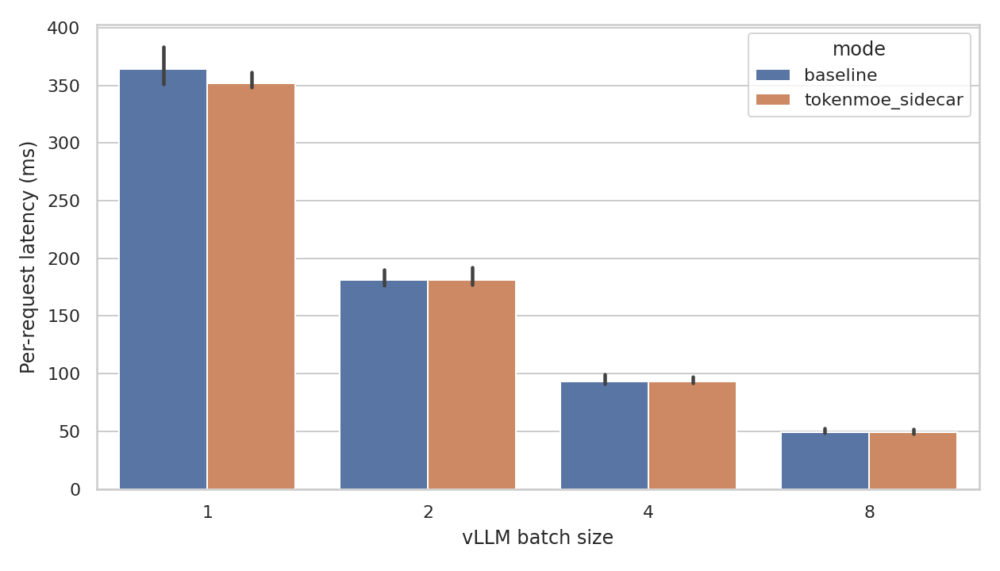
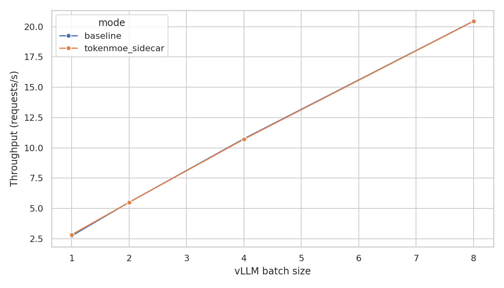
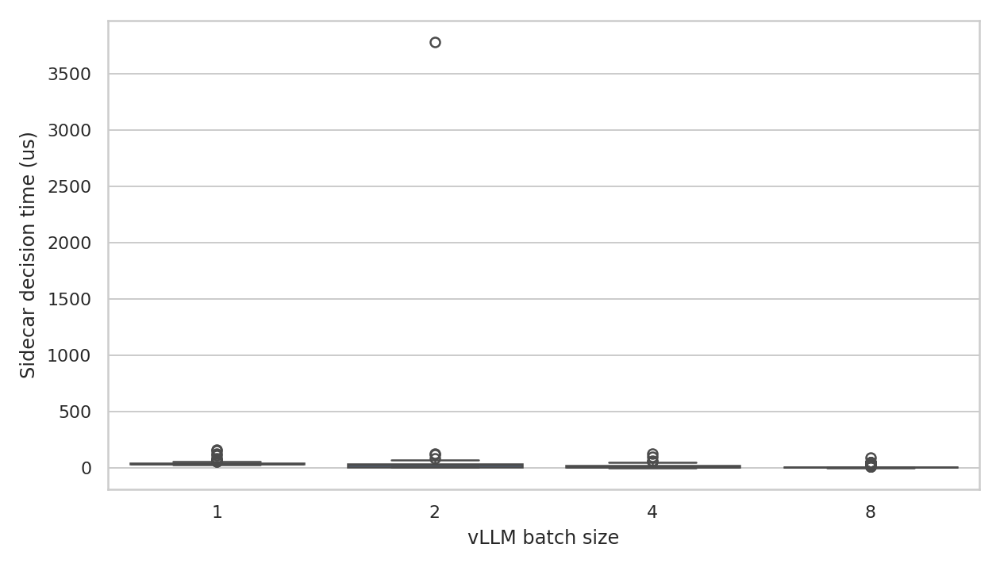

# TokenMoE 实验与论文工作报告

## 1. 留档与复现实验资产

- 已把上一版 Transformers/MoE trace 结论完整复制到 `archives/initial_transformers_20260702_033110/`。
- 当前重新实验保留了原始数据、日志、图、报告和论文仓库。
- 关键数据目录：`data/traces/`、`data/vllm_qwen/`、`analysis/`、`reports/`、`logs/`、`TokenMoE-paper/`。

## 2. 环境与模型

- Conda 环境：`tokenmoe`。
- 已验证栈：Python 3.10, PyTorch 2.6.0+cu124, vLLM 0.8.5.post1, Transformers 4.51.3, xFormers 0.0.29.post2。
- 目标模型：`/home/youwei/bzh/model/Qwen/Qwen2.5-7B-Instruct`。
- vLLM 实际导入路径：`/home/youwei/anaconda3/envs/tokenmoe/lib/python3.10/site-packages/vllm/__init__.py`。
- 模型能力判定：`model_type=qwen2`，architecture=['Qwen2ForCausalLM']，`supports_routed_expert_capture=False`。
- 结论边界：该 Qwen2.5-7B-Instruct 是 dense Qwen2 CausalLM，不是 MoE；因此真实 vLLM 实验验证 sidecar/fallback 端到端路径，而不是伪造 routed expert trace。

## 3. MoE Trace 证据

- 路由 trace 数：80。
- RouteSig top-4 hit rate：0.861，global-frequency top-4：0.774。
- Prefetch replay hit rate：0.861，wasted prefetch：0.021，stall reduction proxy：160.36 ms。
- EPLB replay p95 tail：moving-average 584.96 -> TokenMoE 546.43。

## 4. 真实 vLLM/Qwen 端到端实验

- 原始 generation 行数：1728。
- Sidecar decision 行数：864。
- 每个 batch size/mode 均为 216 请求，batch sizes = [1, 2, 4, 8]。
- 最佳吞吐：20.45 req/s，模式 `baseline`，batch size 8。
- Sidecar 平均决策耗时：27.30 us/request；所有 sidecar fallback reason 均为 `dense_model_no_moe_router`。
- Baseline vs sidecar exact output match 是测量值，不是强约束：batch=1 为 1.000；batch>1 因 vLLM 分片重启和批执行非 bitwise stable，exact-match 约 0.85-0.87。sidecar 不修改 prompt、sampling 参数或模型权重。

| mode             |   batch_size |   requests |   mean_latency_ms |   p95_latency_ms |   throughput_req_s |   mean_sidecar_us |
|:-----------------|-------------:|-----------:|------------------:|-----------------:|-------------------:|------------------:|
| baseline         |            1 |        216 |           364.523 |          373.065 |              2.743 |             0.000 |
| baseline         |            2 |        216 |           181.362 |          186.847 |              5.514 |             0.000 |
| baseline         |            4 |        216 |            92.961 |           97.085 |             10.757 |             0.000 |
| baseline         |            8 |        216 |            48.888 |           49.787 |             20.455 |             0.000 |
| tokenmoe_sidecar |            1 |        216 |           351.724 |          359.161 |              2.843 |            41.581 |
| tokenmoe_sidecar |            2 |        216 |           181.528 |          187.328 |              5.509 |            42.746 |
| tokenmoe_sidecar |            4 |        216 |            93.328 |           94.763 |             10.715 |            14.904 |
| tokenmoe_sidecar |            8 |        216 |            48.924 |           49.753 |             20.440 |             9.968 |

## 5. 失败、干扰与日志

- Transformers 5.12.1 与 vLLM 0.8.5 的 tokenizer API 不兼容，已降级到 Transformers 4.51.3，日志保存在 `logs/env_transformers_downgrade_20260702.log`。
- 长进程 full run 曾在 60 条 batch=1 baseline 后出现 vLLM V1 engine 清理挂起，改为可恢复 sharded runner。
- GPU 1 曾被外部 `tt_lmcache` 任务占用约 70GB，导致 OOM；失败日志已保留，最终 run 切换到 GPU 0 并加入连续空闲检查。
- 主要日志：`logs/vllm_qwen_full_sharded_20260702*`、`logs/vllm_qwen_resume_gpu0_full_sharded_20260702*`、`logs/analyze_traces_rerun_20260702.log`。

## 6. 论文产物

- 已创建论文仓库：`TokenMoE-paper/`。
- 结构对齐 TokenTown-paper：`main.tex`、`preamble.tex`、`tex/*.tex`、`reference.bib`、`img/exp/*.png`。
- 论文主要观点：Agent metadata 可以作为 MoE expert working set 的早期控制信号；RouteSig 提供可置信、可 fallback 的预测；dense Qwen vLLM 实验验证部署边界。

## 7. 核心结论

TokenMoE 的创新点不在于替代 MoE router，而在于把 agent control-plane metadata 提前转化为 expert working-set prior。小型真实 MoE trace 显示该 prior 对 expert prediction 有增益；真实 vLLM/Qwen 实验显示在 dense 模型上系统能端到端运行并正确拒绝 MoE 优化路径。这两个结果共同限定了一个扎实的下一步：接入真正的 Qwen-MoE 或 Mixtral-class vLLM routed capture 后，把 replay policy 推进到 online expert prefetch/placement。
